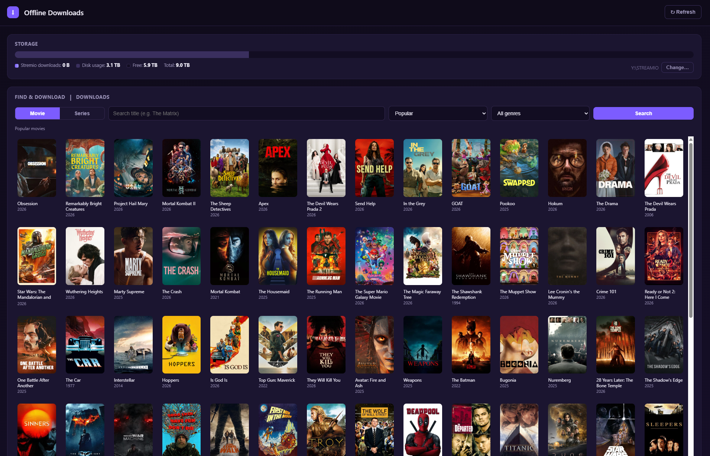
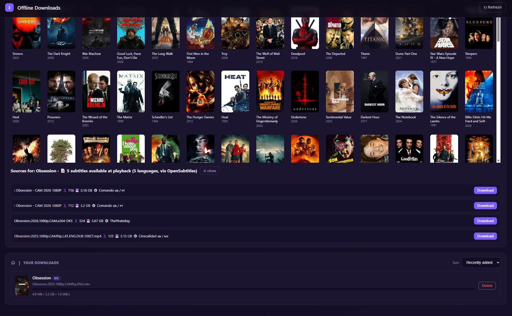

# Stremio Offline Downloader

A self-contained [Stremio](https://www.stremio.com/) addon that **fully downloads movies and TV episodes to disk** for buffer-free, fully offline playback — keeping every audio and subtitle track. It also ships a web dashboard for browsing titles, picking sources, watching download progress, and managing storage.

It has **zero external dependencies** and runs on the Node runtime that already ships with Stremio (`stremio-runtime.exe`), so there is nothing to `npm install`.

> **This is a self-hosted addon — you run it on your own machine.** There is no shared server to install from. You clone this repo, start the addon, and install it in Stremio from your own local URL (`http://127.0.0.1:11473/manifest.json`). It works only on the computer where it's running, because it drives *that* machine's Stremio torrent engine and saves files to *that* machine's disk. See [Setup](#setup) below.

> **Platform:** Windows. The launcher scripts, folder picker, and disk-space checks use Windows-specific tooling (PowerShell, `DriveInfo`, VBScript). The core `addon.js` is portable Node, but paths and helpers assume a Windows Stremio install.

**Maintainer:** Hagay Bar · <hagay_bar@outlook.com> · [LinkedIn](https://www.linkedin.com/in/hagay-bar-3741ba6b/)

---

## Screenshots

**Browse & search** — find any movie or series and queue a download:



**Pick a source & track downloads** — choose quality/source, see available subtitle tracks, and manage your offline library:



---

## How it works

Stremio bundles a local streaming/torrent server on `127.0.0.1:11470`. This addon **drives that existing engine** rather than running its own:

1. For a given title, it queries [Torrentio](https://torrentio.strem.fun) for torrent sources (sorted best-quality-first, then by seeders).
2. It asks Stremio's engine to create the torrent, then pulls the chosen video file (plus any sidecar subtitle files) over HTTP to a local folder.
3. Once on disk, the file is served back to Stremio over the LAN IP with full HTTP range support — so playback is instant, never buffers, and includes all tracks.
4. A "Save offline + play" stream lets you **start watching immediately while the file saves in the background**.

The addon never spawns its own copy of Stremio's `server.js` — doing so would race with Stremio's own server and can crash it. It only checks that port `11470` is reachable.

### Components

| File | Role |
|------|------|
| `addon.js` | The whole addon: HTTP server, Stremio addon protocol, torrent/download manager, file serving, and the dashboard API. Listens on port **11473**. |
| `dashboard.html` | The web UI (search, sources, downloads, storage). Inlined and served at `/`. |
| `Start-Offline-Addon.bat` | Manual launcher — starts the addon on Stremio's runtime and opens the dashboard. |
| `watch-addon.ps1` | Watchdog that ties the addon's lifecycle to Stremio: starts `addon.js` when port 11470 comes up, stops it when Stremio exits. |
| `run-watcher-hidden.vbs` | Launches the watcher with no console window (used by a login scheduled task). |
| `pickfolder.ps1` | Shows the native Windows "Browse for Folder" dialog for choosing the downloads directory. |

---

## Requirements

- **Stremio desktop app** installed (provides `stremio-runtime.exe` and the streaming server on port 11470). The Stremio app must be running for downloads to work.
- **Windows 10/11.**
- *(Optional)* **VLC** — used as the external player for the dashboard's ▶ Play button if found at the default install path; otherwise the system default player is used.

---

## Setup

### 1. Configure paths

The scripts contain hard-coded paths that you must point at your own machine. Update these to match your install:

- In `Start-Offline-Addon.bat`, `watch-addon.ps1`, and `run-watcher-hidden.vbs`:
  - `stremio-runtime.exe` location (default: `C:\Users\<you>\AppData\Local\Programs\Stremio\stremio-runtime.exe`)
  - the addon directory path
- These can also be overridden at runtime via environment variables (see [Configuration](#configuration)).

### 2. Run the addon

Double-click **`Start-Offline-Addon.bat`**. It will:
- start `addon.js` on Stremio's bundled runtime, and
- open the dashboard at <http://127.0.0.1:11473/>.

Keep that window open while you use offline downloads.

### 3. Install the addon in Stremio

In Stremio, add the addon by URL:

```
http://127.0.0.1:11473/manifest.json
```

or click the install link the launcher prints:

```
stremio://127.0.0.1:11473/manifest.json
```

You'll now see an **"Offline Downloader"** entry under streams (to save + play) and an **"Offline Downloads"** catalog (your downloaded library).

### 4. (Optional) Auto-start with Stremio

To have the addon start and stop automatically alongside Stremio:

1. Point the paths in `watch-addon.ps1` and `run-watcher-hidden.vbs` at your addon directory.
2. Register a **Task Scheduler** task that runs `run-watcher-hidden.vbs` at login. The watcher polls port 11470 every 5 seconds and manages the addon process for you (with a 2-poll grace period before shutdown).

---

## Using it

### From Stremio
- Open any movie or episode. Under streams you'll see **"Offline Downloader → Save offline + play"** options. Selecting one starts the download **and** begins playback immediately.
- Completed items appear as an **"Offline"** play option (instant, buffer-free) and in the **"Offline Downloads"** catalog.

### From the dashboard (<http://127.0.0.1:11473/>)
- **Search** movies or series by title (powered by Cinemeta), or browse Popular / New.
- **Pick a source** per title/episode and start a download.
- **Track progress** — live percentage, speed, and size for active downloads.
- **Play** completed files in VLC / your default player, copy a Stremio play link, **retry** failed downloads, or **delete** them (removes the file and sidecar subtitles).
- **Manage storage** — see free/total disk space and space used by your downloads, and **change the downloads folder** (existing downloads are moved to the new location).
- **Add manually** — paste a magnet link or infohash to queue a download directly.

---

## Configuration

`addon.js` reads these environment variables (all optional):

| Variable | Default | Purpose |
|----------|---------|---------|
| `OFFLINE_PORT` | `11473` | Port the addon/dashboard listens on. |
| `OFFLINE_DIR` | `<home>\Downloads\Stremio` | Downloads directory. Overrides the folder saved in `data/downloads.json`. |
| `OFFLINE_STREAM_HOST` | auto-detected LAN IP | Host advertised in play/stream URLs (Stremio may ignore `127.0.0.1` streams). |
| `OFFLINE_TORRENTIO` | `https://torrentio.strem.fun` | Torrentio base URL for source lookups. |
| `OFFLINE_PLAYER` | VLC if installed | Path to the external player for the dashboard Play button. |
| `STREMIO_DIR` | `...\Programs\Stremio` | Stremio install directory. |

### Runtime data

The addon writes runtime state under `data/` (created automatically):
- `downloads.json` — the download database and saved settings (downloads folder).
- `*.log` / `*.err` / `*.pid` — process logs and bookkeeping.

These, along with the `downloads/` output folder and local tooling, are excluded from git via `.gitignore`.

---

## Notes & limitations

- **Stremio must be running** — the addon depends on Stremio's streaming server (port 11470). If it isn't reachable, downloads fail with a clear message.
- For **movies**, TV-episode files that Torrentio sometimes mixes in from multi-title packs are filtered out automatically.
- Downloads **resume on startup** if they were interrupted while in progress.
- A **3% disk headroom** check runs before each download; it won't block if disk space can't be read.
- This tool only orchestrates Stremio's own torrent engine and public addons. You are responsible for ensuring your use complies with the law in your jurisdiction.

---

## Author

**Hagay Bar**
- Email: <hagay_bar@outlook.com>
- LinkedIn: <https://www.linkedin.com/in/hagay-bar-3741ba6b/>
